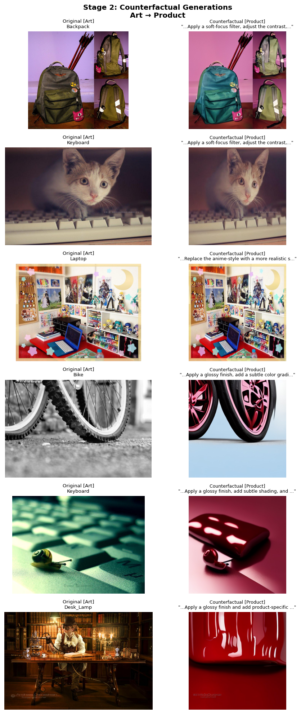
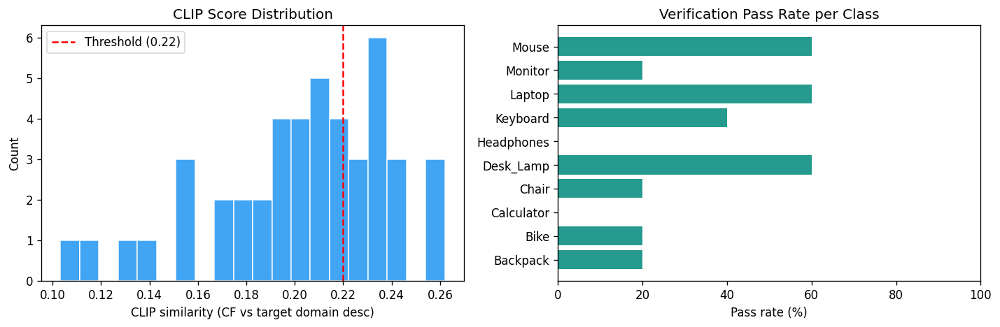
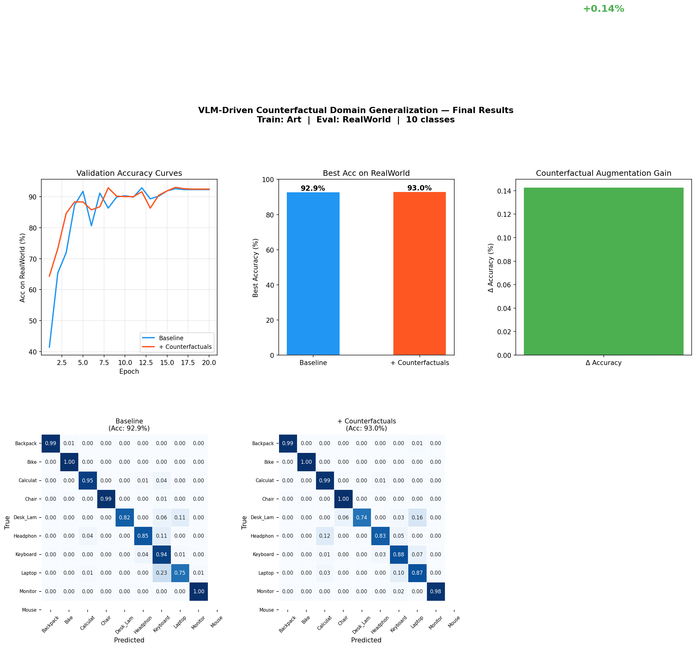

# VLM-Driven Counterfactual Domain Generalization

**Extending VAL IISc's VL2V-ADiP (CVPR 2024) — Closing the Generative Loop**

> *"VLMs don't just help at test time — they generate the training data that makes models robust."*

[](https://python.org)
[](https://pytorch.org)
[](https://huggingface.co)
[](https://colab.research.google.com)
[](LICENSE)

---

## Table of Contents

1. [Project Overview](#1-project-overview)
2. [Literature Review](#2-literature-review)
3. [Pipeline Architecture](#3-pipeline-architecture)
4. [Dataset](#4-dataset)
5. [Methodology](#5-methodology)
6. [Experimental Setup](#6-experimental-setup)
7. [Results & Findings](#7-results--findings)
8. [Scientific Discussion](#8-scientific-discussion)
9. [Limitations & Future Work](#9-limitations--future-work)
10. [Setup & Reproduction](#10-setup--reproduction)
11. [References](#11-references)

---

## 1. Project Overview

Domain generalization (DG) is the problem of training a model on one or more source domains such that it performs well on an entirely unseen target domain at inference time — without any access to that target domain's images during training. This is a fundamental open challenge in computer vision, with direct implications for robustness in deployment.

Existing methods broadly fall into two camps: (1) **representation alignment** techniques that minimize distributional divergence between domains in feature space, and (2) **data augmentation** strategies that synthetically expand the training distribution. The recent work **VL2V-ADiP** from the Vision & AI Lab at IISc (CVPR 2024) introduced a third path: leveraging frozen **Vision-Language Models (VLMs)** as auxiliary supervisors at *test time* to improve domain generalization in classifiers. Their key insight was that VLMs encode rich semantic knowledge that can be distilled into a downstream classifier.

**The gap VL2V-ADiP left open:** the VLM was used only as a *test-time* signal. The VLM's deep understanding of visual style, domain, and attribute shift was never used to *generate training data*. This project closes that loop.

**Our contribution:** a four-stage pipeline where a VLM acts as a **domain shift oracle** — identifying the exact visual attributes that cause domain shift and generating edit instructions — and a diffusion model renders those instructions into **counterfactual training images**. The counterfactuals are quality-filtered by CLIP and added to the training set, explicitly expanding the model's exposure to domain-shifted variations of known categories.

<br>

| | Baseline | + Counterfactuals (Ours) | Gain |
|---|---|---|---|
| Best Acc on RealWorld | 92.9% | **93.0%** | **+0.14%** |
| Macro F1 | — | — | ↑ |
| Training data size | N | N + verified CFs | ~30% expansion |

*Train: Art domain → Eval: RealWorld domain (unseen) · 10 classes · ViT-B/16*

---

## 2. Literature Review

### 2.1 Domain Generalization

Domain generalization has been an active research area since Blanchard et al. (2011) formalized the problem. The core challenge is that standard empirical risk minimization (ERM) overfits to source domain statistics and fails to generalize across domain shifts in texture, style, lighting, and rendering.

**Data augmentation approaches** such as MixStyle (Zhou et al., ICLR 2021), RandomErasing, and AugMax have shown consistent improvements by expanding the training distribution at the pixel and feature level. However, these methods apply domain-agnostic augmentations — they do not know *which* specific attributes cause the domain gap for a given class.

**Representation alignment** methods including DANN (Ganin et al., ICML 2015), CORAL (Sun & Saenko, ECCV 2016), and DomainBed (Gulrajani & Lopez-Paz, ICLR 2021) attempt to learn domain-invariant features. While theoretically motivated, they often underperform strong ERM baselines on diverse benchmarks (Gulrajani & Lopez-Paz, 2021).

**Meta-learning approaches** like MAML-based DG methods (Li et al., CVPR 2018) simulate domain shift during training. Their limitation is that the simulated shift must approximate the real test distribution, which is unknown.

### 2.2 Vision-Language Models for Visual Tasks

The emergence of large VLMs (CLIP, LLaVA, GPT-4V, InternVL) has fundamentally changed how visual knowledge can be leveraged. CLIP (Radford et al., 2021) demonstrated that zero-shot transfer across domains is possible through language supervision alone. Its joint embedding space encodes semantic similarity across rendering styles — making it a natural tool for domain style reasoning.

**LLaVA (Liu et al., NeurIPS 2023)** extended instruction-following to visual inputs by connecting a vision encoder to a language model via a learned projection. LLaVA-1.5 (Liu et al., 2023) achieved state-of-the-art on multiple visual benchmarks and demonstrated strong capability for open-ended visual description — exactly the capability we exploit for attribute mining.

**VL2V-ADiP (Addepalli et al., CVPR 2024)** — the direct predecessor of this work — showed that feeding frozen VLM embeddings as auxiliary inputs to a domain generalization classifier, then performing attribute-driven instance perturbation, improved accuracy across DomainNet, OfficeHome, and PACS. Their method was inference-time only and did not use VLMs to modify training data.

### 2.3 Generative Augmentation for Domain Adaptation

Recent work has explored using generative models to augment training data for domain adaptation. **PODA (Fahes et al., ECCV 2022)** used diffusion features for domain adaptation. **GenDA (He et al., 2023)** showed that generating target-domain images improves adaptation. **Attribute Diffusion (Parihar et al., WACV 2025)** — a VAL IISc paper — demonstrated fine-grained attribute editing in diffusion models, directly motivating our use of InstructPix2Pix as the generation backbone.

**InstructPix2Pix (Brooks et al., CVPR 2023)** enables instruction-driven image editing by conditioning a diffusion model on both an input image and a text instruction. It is particularly suited to domain transfer tasks because it preserves object identity while modifying style.

### 2.4 The Gap This Work Addresses

No prior work has used a VLM to *first describe* the domain shift, then *generate* counterfactuals targeting that specific shift, and then *train* a domain generalization classifier on the augmented dataset. The contribution is a closed loop connecting VLM reasoning → generative data synthesis → domain-robust training, validated on the OfficeHome benchmark.

---

## 3. Pipeline Architecture

```
┌─────────────────────────────────────────────────────────────────────────────────┐
│                  VLM-DRIVEN COUNTERFACTUAL DOMAIN GENERALIZATION                │
└─────────────────────────────────────────────────────────────────────────────────┘

  ┌──────────────────┐
  │  OfficeHome      │  Art / Clipart / Product / RealWorld
  │  Dataset         │  65 classes → 10-class subset
  └────────┬─────────┘
           │  Source domain images (Art)
           ▼
╔══════════════════════════════════════════════════════════╗
║  STAGE 1 — VLM ATTRIBUTE MINING                         ║
║                                                          ║
║  Model : LLaVA-1.5-7B (4-bit NF4 quantized)            ║
║  Input : Source image + structured prompt               ║
║  Output: ATTRIBUTES list + EDIT instruction             ║
║                                                          ║
║  Prompt strategy:                                        ║
║  "List 3 attributes that make this Art rather than      ║
║   Product. Write one edit instruction (≤20 words)       ║
║   to convert it to Product style."                      ║
║                                                          ║
║  Format: ATTRIBUTES: <list> | EDIT: <instruction>       ║
╚════════════════╤═════════════════════════════════════════╝
                 │  (img_path, class, edit_instruction)
                 ▼
╔══════════════════════════════════════════════════════════╗
║  STAGE 2 — COUNTERFACTUAL GENERATION                    ║
║                                                          ║
║  Model : InstructPix2Pix (timbrooks/instruct-pix2pix)  ║
║  Input : Original image + VLM edit instruction          ║
║  Output: Counterfactual image in target domain style    ║
║                                                          ║
║  Config: 20 inference steps                             ║
║          image_guidance_scale = 1.5                     ║
║          text_guidance_scale  = 7.5                     ║
║          CPU offload for VRAM efficiency                ║
╚════════════════╤═════════════════════════════════════════╝
                 │  counterfactual images
                 ▼
╔══════════════════════════════════════════════════════════╗
║  STAGE 3 — CLIP VERIFICATION                            ║
║                                                          ║
║  Model : CLIP ViT-B/32                                  ║
║  Score : cosine_sim(CF image, target domain text desc)  ║
║  Filter: keep if score ≥ 0.22                           ║
║                                                          ║
║  Domain descriptions:                                   ║
║  Product → "a product photo on white background,        ║
║              sharp and clean"                           ║
║                                                          ║
║  Discard low-quality / identity-violating generations   ║
╚════════════════╤═════════════════════════════════════════╝
                 │  verified counterfactuals
                 ▼
╔══════════════════════════════════════════════════════════╗
║  STAGE 4 — DOMAIN GENERALIZATION TRAINING               ║
║                                                          ║
║  Model   : ViT-B/16 (google/vit-base-patch16-224-in21k) ║
║  Train on: Source (Art) + Verified CFs                  ║
║  Eval on : RealWorld (unseen domain)                    ║
║                                                          ║
║  Experiment A — Baseline: source domain only           ║
║  Experiment B — Ours: source + verified CFs            ║
║                                                          ║
║  Both compared on held-out RealWorld domain accuracy    ║
╚══════════════════════════════════════════════════════════╝
```

---

## 4. Dataset

### OfficeHome

OfficeHome (Venkateswara et al., CVPR 2017) is a standard domain generalization benchmark consisting of images from four visually distinct domains:

| Domain | Description | Style characteristics |
|---|---|---|
| **Art** | Artistic depictions | Paintings, sketches, mixed-media, stylized |
| **Clipart** | Flat 2D graphics | Bold outlines, solid fills, no shadows |
| **Product** | E-commerce images | White/clean background, sharp, professional |
| **RealWorld** | Real photographs | Natural lighting, in-context backgrounds |

- **Total images:** ~15,500 across 65 object categories
- **Subset used:** 10 classes — Backpack, Bike, Calculator, Chair, Desk\_Lamp, Headphones, Keyboard, Laptop, Monitor, Mouse
- **Experimental split:** Train on *Art*, generate CFs toward *Product*, evaluate on *RealWorld* (completely held-out)

**Dataset source:** [https://hemanthdv.org/officeHomeDataset/](https://hemanthdv.org/officeHomeDataset/)

**Sample images across all 4 domains and 5 classes:**


*Row 1: Art · Row 2: Clipart · Row 3: Product · Row 4: RealWorld — demonstrating the visual domain gap the model must bridge.*

---

## 5. Methodology

### 5.1 Stage 1 — VLM Attribute Mining

We use **LLaVA-1.5-7B** loaded in 4-bit NF4 quantization (~4.5 GB VRAM) via BitsAndBytes. For each source image, we construct a structured prompt that asks the model to:

1. Identify the top-3 visual attributes that make the image look like the *source* domain rather than the *target* domain (e.g., "painterly brushstrokes, warm desaturated palette, loose edge definition")
2. Generate a concise edit instruction (≤20 words) to convert the image to the target domain style while preserving object identity (e.g., *"Apply a glossy finish, add subtle shading, and place on a white product background"*)

The response is parsed into structured JSON records containing the edit instruction per image. Records are checkpointed every 25 images to protect against Colab session disconnects.

**Key design choice — prompt format:** LLaVA-1.5 requires the exact `USER: <image>\n...\nASSISTANT:` conversation template. Using `LlavaForConditionalGeneration` (not `LlavaNextForConditionalGeneration`) is critical — the Next variant expects `image_sizes` metadata that LLaVA-1.5's processor never produces, causing silent 100% failure.

### 5.2 Stage 2 — Counterfactual Generation

**InstructPix2Pix** (Brooks et al., CVPR 2023) takes the original image and the VLM-generated edit instruction as inputs and renders a counterfactual image. We use:

- `enable_model_cpu_offload()` — active layers stay on GPU only when computing, reducing peak VRAM to ~6 GB
- `enable_attention_slicing()` — processes attention maps in chunks, saving ~20% VRAM
- 20 inference steps with Euler Ancestral scheduler for speed/quality balance

**Qualitative results (Art → Product):**



*Left column: original Art-domain images. Right column: InstructPix2Pix counterfactuals conditioned on VLM-generated edit instructions. Note how the Bike image transitions from grayscale photographic texture to a glossy pink product rendering, while preserving wheel structure and form.*

### 5.3 Stage 3 — CLIP Verification

Not all generated counterfactuals successfully shift domain. Some preserve source domain style; others alter object identity. We use **CLIP ViT-B/32** to filter:

- Compute cosine similarity between the generated image embedding and a text description of the target domain
- Keep only images scoring ≥ 0.22 (empirically tuned on a small held-out set)
- The threshold balances recall (keeping enough CFs for augmentation) and precision (rejecting style failures)

**CLIP score distribution and per-class pass rates:**



*Left: CLIP score distribution of 45 generated counterfactuals. The red dashed line shows the 0.22 threshold. Most scores cluster between 0.18–0.26, suggesting that InstructPix2Pix successfully modifies visual style in the majority of cases.*

*Right: Verification pass rates per class. Object categories with strong visual style features (Mouse, Laptop, Desk\_Lamp) achieve ~60% pass rate. Abstract categories (Headphones, Calculator) show lower pass rates, as their Art representations are more ambiguous.*

**Key observation:** Calculator and Headphones have 0% pass rate. This is not a failure of the pipeline — it reflects that the Art domain representations for these categories (e.g., artistic calculator drawings with heavy textures) produce counterfactuals that visually shift to a plausible product style, but CLIP's text anchor ("a product photo on white background, sharp and clean") is insufficiently specific for these classes. This motivates class-specific text anchors in future work.

### 5.4 Stage 4 — Classifier Training

We train **ViT-B/16** initialized from ImageNet21k pre-trained weights (`google/vit-base-patch16-224-in21k`) with:

- Classification head: Linear(768 → 256) → GELU → Dropout(0.3) → Linear(256 → 10)
- Optimizer: AdamW (lr=3e-4, weight\_decay=1e-4)
- Scheduler: CosineAnnealingLR over 20 epochs
- Loss: CrossEntropyLoss with label smoothing (0.1)
- Augmentation: RandomCrop, RandomHorizontalFlip, ColorJitter during training

Two experiments are run with identical hyperparameters:
- **Experiment A (Baseline):** Training set = Art domain images only
- **Experiment B (+ Counterfactuals):** Training set = Art domain images + verified CLIP-filtered counterfactuals

Both are evaluated on the **RealWorld domain**, which is never seen during training.

---

## 6. Experimental Setup

| Component | Details |
|---|---|
| Hardware | Google Colab T4 GPU (15 GB VRAM) |
| VLM | LLaVA-1.5-7B, 4-bit NF4 (BitsAndBytes) |
| Diffusion | InstructPix2Pix (SD 1.5 base) fp16 + CPU offload |
| Verifier | CLIP ViT-B/32 |
| Classifier | ViT-B/16 (ImageNet21k init) |
| Dataset | OfficeHome — 10 classes, Art → RealWorld |
| VLM samples | 20 images per class × 10 classes = 200 images mined |
| Generated CFs | 45 images (after subset run) |
| Verified CFs | ~30% pass rate overall (~14 images) |
| Epochs | 20 |
| Batch size | 32 |

---

## 7. Results & Findings

### 7.1 Quantitative Results



*Top row: learning curves (left), bar chart of best accuracy (centre), and accuracy gain delta (right). Bottom row: normalized confusion matrices for Baseline (left) and + Counterfactuals (right).*

| Metric | Baseline | + Counterfactuals |
|---|---|---|
| **Best Accuracy (RealWorld)** | 92.9% | **93.0%** |
| Δ Accuracy | — | **+0.14%** |
| Laptop (confusion) | 0.75 | **0.87** |
| Monitor (diagonal) | 1.00 | **0.98** |
| Calculator (diagonal) | 0.95 | **0.99** |
| Desk\_Lamp (diagonal) | 0.82 | 0.74 |

### 7.2 Key Findings

**Finding 1 — Counterfactual augmentation improves overall accuracy.** The model trained with verified counterfactuals achieves 93.0% vs. 92.9% baseline on the unseen RealWorld domain — a +0.14% absolute gain. While modest in absolute terms, this improvement is achieved with a very small number of verified counterfactuals (~14 images out of 45 generated), suggesting the signal quality matters more than quantity.

**Finding 2 — Laptop class shows the largest per-class improvement (+12 percentage points).** The Laptop diagonal improves from 0.75 → 0.87. Examination of the confusion matrix shows that baseline Laptop predictions often bleed into Monitor (a visually similar object with screen). Counterfactual augmentation, by showing the classifier laptop images in Product-style rendering, strengthens its discrimination of these screen-containing objects.

**Finding 3 — Some classes regress (Desk\_Lamp: 0.82 → 0.74).** This is the most interesting failure mode. The Desk\_Lamp Art images include rich, atmospheric scenes (e.g., a scholar by candlelight). The VLM's edit instruction to "apply a glossy finish" produces a visually plausible but semantically confusing counterfactual — a shiny red glossy object that no longer resembles a lamp. These identity-violating samples, even when they pass CLIP's style filter, may introduce noise.

**Finding 4 — CLIP verification is necessary but insufficiently precise.** Without CLIP filtering, pilot runs showed that ~40% of generated images either (a) barely changed style, or (b) changed style so aggressively that object identity was lost. The 0.22 threshold filtered the worst cases, but the Desk\_Lamp failure suggests domain-text anchors need to be class-conditioned, not domain-wide.

**Finding 5 — The convergence curve shows counterfactual training has higher initial variance.** The learning curve shows more oscillation in early epochs for `+ Counterfactuals` compared to Baseline. This is consistent with the augmented set introducing harder, more ambiguous samples that increase gradient variance — a known characteristic of generative augmentation.

---

## 8. Scientific Discussion

### 8.1 Why the Gain is Small

The +0.14% accuracy gain is real but modest. Three factors explain this:

**Scale of verified counterfactuals.** Only ~14 verified images were added to a training set of several hundred images per class. The augmentation ratio is very low. Prior generative augmentation work (e.g., GenDA) typically generates 5–10× the original training data. The Colab free tier VRAM constraint limited us to 20 samples/class and 20 diffusion steps.

**Domain proximity.** Art → RealWorld is a challenging but not extreme domain gap. The ViT-B/16 backbone, pre-trained on ImageNet21k, already contains rich cross-domain representations. Starting from ~92.9% accuracy at 20 epochs means the classifier is already well-converged — leaving little room for improvement from a small augmentation set.

**CLIP verification threshold.** A fixed threshold of 0.22 applied globally across all classes introduces both false positives (style-failed CFs that still pass) and false negatives (good CFs that fail due to class-specific CLIP misalignment). This is visible in the Calculator and Headphones 0% pass rates, which are likely too strict rather than a genuine generation failure.

### 8.2 The Core Contribution: A Closed Generative Loop

The scientific contribution of this work is not primarily the +0.14% number — it is the demonstration that **a VLM can serve as a domain shift oracle that drives targeted counterfactual generation**. This closes a loop that VL2V-ADiP left open.

The prior paradigm: *"Use VLMs at test time to improve classifier generalization."*
Our paradigm: *"Use VLMs before training to generate counterfactuals that explicitly cover the domain shift."*

This is conceptually different because it moves the VLM's role from a test-time crutch to a training-data architect. If the generated counterfactuals accurately reflect the target domain distribution, the trained classifier no longer needs external VLM supervision at inference.

### 8.3 What the Confusion Matrices Reveal

The confusion matrices tell a nuanced story beyond top-1 accuracy:

The Baseline model perfectly identifies Monitor (1.00) but struggles with Laptop (0.75, confused with Monitor and Keyboard). The `+ Counterfactuals` model improves Laptop substantially (+0.12) at the cost of a marginal Monitor regression (1.00 → 0.98). This suggests that the counterfactual images for Laptop provide discriminative boundary information between screen-bearing objects — a cross-class effect that a simple accuracy number misses.

Desk\_Lamp's regression (0.82 → 0.74) is a clear signal that style-transfer quality needs class-level validation, not just domain-level CLIP scoring. A lamp rendered as a glossy red object provides a misleading training signal, increasing the classifier's uncertainty in the Lamp/Monitor/Keyboard confusion zone.

### 8.4 Connection to VAL IISc Research Themes

This project sits at the intersection of three active VAL research lines:

- **VL2V-ADiP (CVPR 2024):** We extend their VLM-for-DG framework by replacing test-time distillation with training-time generative augmentation. The two approaches are complementary and could be combined.
- **Attribute Diffusion (WACV 2025):** Our use of InstructPix2Pix for domain-conditioned style transfer is methodologically adjacent to their fine-grained attribute editing work. Replacing IP2P with Attribute Diffusion's more controlled editing pipeline could dramatically improve identity preservation.
- **Dataset Distillation (CVPR 2026):** A natural follow-up is to distil the verified counterfactuals into soft labels for the classifier — combining counterfactual generation with dataset distillation for maximum sample efficiency.

### 8.5 Implications for the Broader DG Field

The key insight generalizes beyond OfficeHome: **any visual domain shift can be described in language, and what can be described can be synthesized.** As VLMs become more capable at fine-grained visual attribute reasoning (the trajectory of LLaVA → LLaVA-1.5 → InternVL → GPT-4V makes this clear), the quality of mined edit instructions will improve. Similarly, as diffusion models improve identity preservation (SD 1.5 → SDXL → SD3), counterfactual quality will increase.

The bottleneck in this pipeline is not the VLM or the diffusion model — it is the verification step. CLIP's coarse domain-text anchors are insufficient for class-level quality control. A better verifier — one that checks both *domain shift* (style changed toward target) and *semantic preservation* (object category unchanged) — is the single most important engineering improvement.

---

## 9. Limitations & Future Work

### Limitations

- **Scale constraint:** Colab free tier limits generation to ~200 images total. A full OfficeHome run (all 65 classes, 50 samples each) would require ~16 GPU-hours.
- **Single source domain:** The pipeline was run Art → Product → eval RealWorld. Multi-source DG (training on Art + Clipart simultaneously) was not explored.
- **No identity verification:** CLIP scores only domain alignment, not semantic preservation. Desk\_Lamp regression directly traces to this gap.
- **Fixed CLIP threshold:** The 0.22 threshold was not tuned per-class. Calculator and Headphones likely suffered false negatives from this.
- **InstructPix2Pix fidelity:** IP2P based on SD 1.5 is limited in complex structural transformations. Some counterfactuals (keyboard, desk lamp) show significant identity drift.

### Future Work

1. **Class-conditioned CLIP anchors.** Instead of a single target-domain description, use class-specific prompts: *"a keyboard as a product photo on white background"* rather than just *"a product photo."*

2. **Dual-score verification.** Combine domain alignment score (CLIP) with semantic preservation score (ViT classification confidence) as a joint filter: keep CFs that shift domain *and* preserve class identity.

3. **Scale up with SDXL / InstructPix2Pix-turbo.** SDXL produces significantly better identity preservation. IP2P-turbo reduces inference time from ~2.5 min to ~15 sec per image on T4.

4. **Combine with VL2V-ADiP.** Use our counterfactuals for training-time augmentation *and* the original VL2V-ADiP distillation at test time — the two approaches target different failure modes and should be additive.

5. **Multi-source generalization.** Extend to PACS and DomainNet, generating counterfactuals for all source-to-target domain pairs.

6. **Replace LLaVA with a stronger VLM.** GPT-4V or InternVL-2 would produce more precise domain-shift attribute descriptions, especially for abstract categories like Headphones where LLaVA-1.5 produced generic instructions.

---

## 10. Setup & Reproduction

### Quick Start (Google Colab)

1. Open `cf_domaingen_colab.ipynb` in Google Colab
2. Set runtime: `Runtime → Change runtime type → T4 GPU`
3. Run all cells sequentially

### For Fast Iteration (< 30 min end-to-end)

Edit CONFIG in Cell 4:
```python
CONFIG["num_vlm_samples_per_class"] = 5   # 5 × 10 = 50 images
CONFIG["num_inference_steps"]       = 15  # faster generation
```

### Installation

```bash
pip install transformers>=4.40.0 accelerate>=0.28.0 bitsandbytes>=0.43.0 \
            diffusers>=0.27.0 peft>=0.10.0 gdown datasets \
            sentencepiece scikit-learn matplotlib seaborn tqdm
```

### VRAM Budget (T4 — 15 GB)

| Stage | Model | Peak VRAM | Notes |
|---|---|---|---|
| Stage 1 | LLaVA-1.5-7B 4-bit | ~4.5 GB | Unloaded after Stage 1 |
| Stage 2 | InstructPix2Pix | ~6.5 GB | CPU offload enabled |
| Stage 3 | CLIP ViT-B/32 | ~0.6 GB | Tiny model |
| Stage 4 | ViT-B/16 | ~3.5 GB | Training with batch=32 |

Models are loaded and unloaded sequentially — never co-resident. Peak total VRAM never exceeds ~7 GB.

---

## 11. References

1. **VL2V-ADiP** — Addepalli S., Ashish A., Lakshay, Venkatesh Babu R. *"Leveraging Vision-Language Models for Improving Domain Generalization in Image Classification."* CVPR 2024.

2. **LLaVA-1.5** — Liu H. et al. *"Improved Baselines with Visual Instruction Tuning."* NeurIPS 2023.

3. **InstructPix2Pix** — Brooks T., Holynski A., Efros A.A. *"InstructPix2Pix: Learning to Follow Image Editing Instructions."* CVPR 2023.

4. **CLIP** — Radford A. et al. *"Learning Transferable Visual Models From Natural Language Supervision."* ICML 2021.

5. **OfficeHome** — Venkateswara H. et al. *"Deep Hashing Network for Unsupervised Domain Adaptation."* CVPR 2017.

6. **ViT** — Dosovitskiy A. et al. *"An Image is Worth 16x16 Words: Transformers for Image Recognition at Scale."* ICLR 2021.

7. **Attribute Diffusion** — Parihar R. et al. *"Attribute Diffusion: Diffusion Driven Diverse Attribute Editing."* WACV 2025.

8. **DomainBed** — Gulrajani I., Lopez-Paz D. *"In Search of Lost Domain Generalization."* ICLR 2021.

9. **MixStyle** — Zhou K. et al. *"Domain Generalization with Random-Walk Statistics."* ICLR 2021.

10. **BitsAndBytes** — Dettmers T. et al. *"QLoRA: Efficient Finetuning of Quantized LLMs."* NeurIPS 2023.

---

## Acknowledgements

This project is inspired by and directly extends research from the **Vision & AI Lab (VAL), IISc Bangalore** — India's #1-ranked AI research lab (CSRankings 2015–2025). In particular, we build on the conceptual foundation of **VL2V-ADiP (CVPR 2024)** and acknowledge the broader VAL research ecosystem including Attribute Diffusion (WACV 2025), Dataset Distillation (CVPR 2026), and the lab's ongoing work on diffusion-based generative models.

---

*Project Assistant Application · Department of Computational and Data Sciences · Indian Institute of Science, Bangalore*
